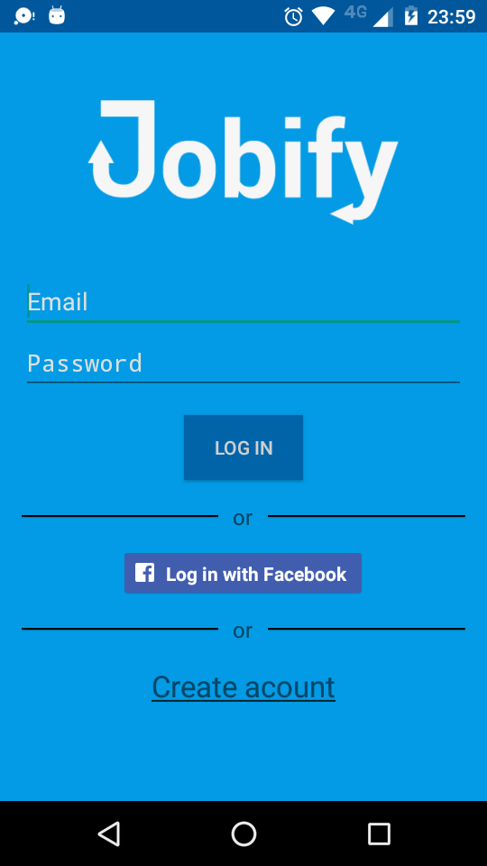
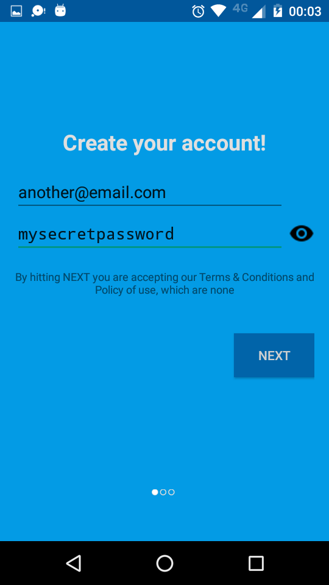
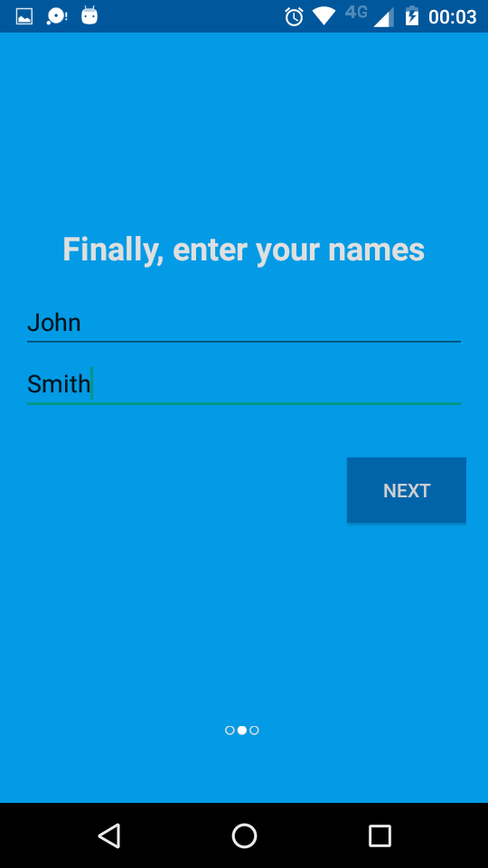
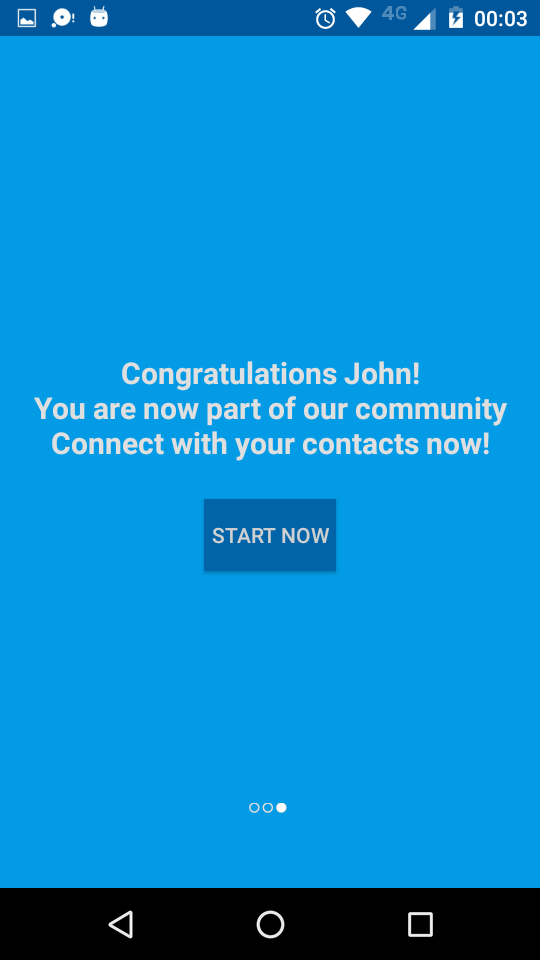
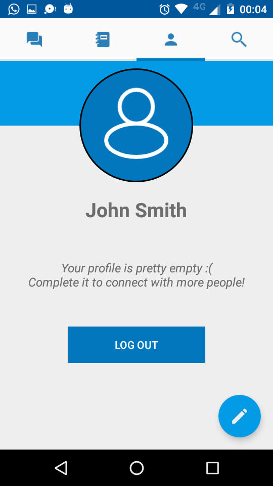
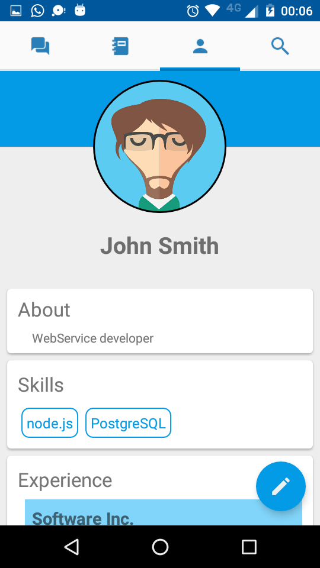
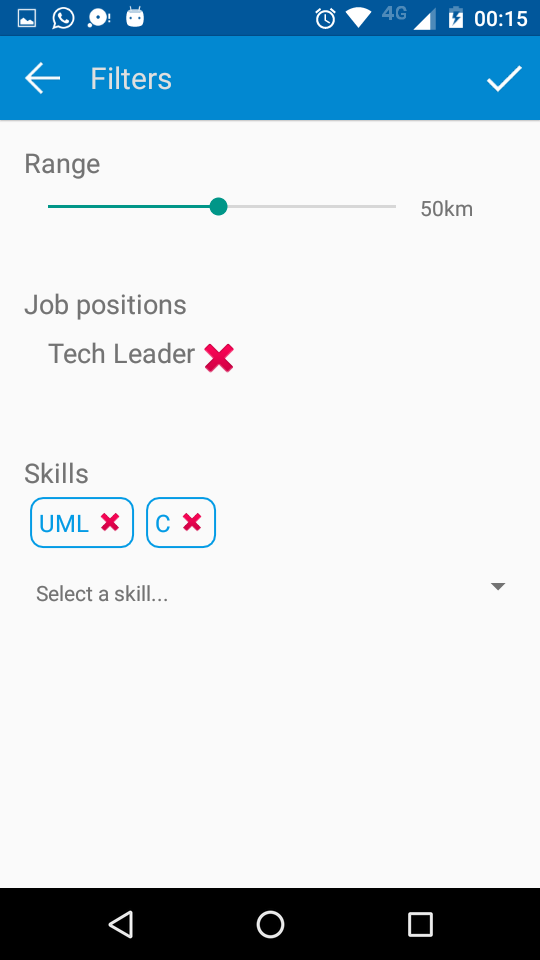

***************************
Jobify

Manual de Administrador
***************************
**Grupo 8**

**Ayudante asignado: Agustín Rojas**

**Integrantes:**

+-------------------------------------+--------------------------------------+
|       Apellido y Nombre             |              Padrón                  |
+=====================================+======================================+
|       Lambre, Juan Manuel           |              95978                   |
+-------------------------------------+--------------------------------------+
|       Longhi, Federico              |                                      |
+-------------------------------------+--------------------------------------+
|       Schulz, Javuer                |              83508                   |
+-------------------------------------+--------------------------------------+

============================================
Instalación
============================================

Shared Server
--------------------------------------------

Application Server
--------------------------------------------
- Clonar desde el repositorio remoto git:
	- ``git clone https://github.com/jaschulz/JobifyAS.git``

- Para ejecutar la aplicación, desde la carpeta AppServer, se debe correr el siguiente comando:
		    - sudo install.sh

Este script instala todo lo necesario para correr la aplicación sin inconvenientes.

Cliente
--------------------------------------------
- Clonar desde el repositorio remote git:
    - ``git clone https://github.com/fede29/Jobify

- Para compilar la aplicación correr ./gradlew

- El binario .apk se encuentra en ./build/outputs/apk

============================================
Usabilidad
============================================

Android
--------------------------------------------
La aplicación se inicia con la pantalla de logueo el cual se puede hacer con email y contraseña del usuario o con Facebook. Alternativamente el usuario puede también crearse una cuenta. Si el usuario elige esta última opción se le abre una pantalla nueva para empezar a crear el usuario.
    Lo primero que se pide es un email y contraseña. Notar que la contraseña puede mostrarse u ocultarse apretando en el ojo (por defecto se muestra oculta). Si el email no existe y el servidor verifica la creación el usuario pasa a la siguiente pantalla donde ingresa su nombre y apellido. Estos campos deben existir necesariamente en esta instancia.

Luego de insertar nombre y apellido se muestra una pantalla confirmando que el registro fue exitoso. Apretando en “START NOW” se inicia la sesión y se muestra la pantalla de Home, donde hay cuatro secciones: mensajes, contactos, perfil y búsqueda.

Desde la sección del perfil se puede terminar la sesión apretando en “LOG OUT”. También se puede editar el usuario apretando en el botón flotante para abrir la pantalla de edición. Desde esta se puede editar la foto de perfil, los nombres, el “job position”, el “about”, las habilidades (skills) y las experiencias. Luego de aceptar los cambios la sección de perfil queda actualizada
    Desde la sección de búsqueda se pueden aplicar filtros para los usuarios. En la pantalla de edición de filtro se puede seleccionar el rango de búsqueda en kilómetros (desde la posición actual del usuario), un job position y varios skills. Los filtros se guardan durante toda la sesión, por lo que mientras no se cierre la aplicación se van a aplicar.

Desde la pantalla de Home se puede acceder a la sección de mensajes en donde se muestra todo el historial de mensajes enviados 

