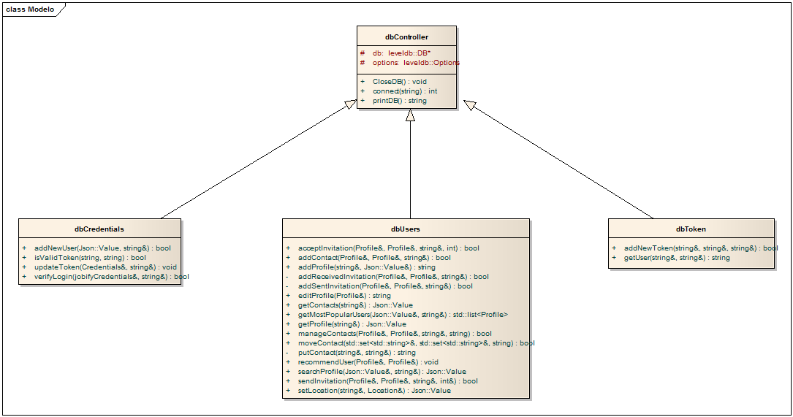

***************************
Jobify

Documentación Técnica
***************************
**Grupo 8**

**Ayudante asignado: Agustín Rojas**

**Integrantes:**

+-------------------------------------+--------------------------------------+
|       Apellido y Nombre             |              Padrón                  |
+=====================================+======================================+
|       Lambre, Juan Manuel           |              95978                   |
+-------------------------------------+--------------------------------------+
|       Longhi, Federico              |                                      |
+-------------------------------------+--------------------------------------+
|       Schulz, Javuer                |              83508                   |
+-------------------------------------+--------------------------------------+

============================================
Tecnologías utilizadas
============================================

Cliente
----------------------------------------

- Pager Sliding Tabstrip 1.0.1 (astuetz)
- OkHttp 3.4.1 (squareup)
- Picasso 2.5.2 (squareup)
- Gson 2.4
- CircleImageView 2.1.0 (hdodenhof)
- ViewPager Indicator 2.4.1 (JakeWharton)
- Facebook Android SDK 4.5.0
- FAB 1.1.2 (shell-software)
- Firebase Auth 9.8.0
- Firebase UI 1.0.0
- Firebase messaging 9.6.1

Application Server
----------------------------------------

- Cmake
- CI-Travis
- Mongoose-cpp
- Jsoncpp
- levelDB
- lcov
- cppunit
- libCurl
- ssl
- Postman, curl y bash para testeos

Shared Server
----------------------------------------

Proyecto
----------------------------------------

============================================
Arquitectura
============================================

Appserver
--------------------------------------------

Esquemas
""""""""""""""""""
Arquitectura del appServer

Las siguientes imagenes ilustran las clases más importante del servidor.

Modelo:

Controllers:

.. image:: Screenshots/Controllers.png

Base de datos:

Recursos
""""""""""""""""""

Para hacer una lectura más sencilla de las requests y responses, se utilizará la siguiente notación:

User:

.. code-block:: json

    {
       email: string,
       first_name: string,
       last_name: string,
       about: string,
       profile_pic: string,
       skills: [SKILLS],
       job_position: JOB_POSITION,
       location: LOCATION,
       experiencies: [EXPERIENCES],
       contacts: [CONTACTS]
    }

Contact:

.. code-block:: json

    {
       email: string,
       first_name: string,
       last_name: string,
       profile_pic: string,
       job_position: JOB_POSITION
    }

Skill:

.. code-block:: json

    {
       name: string,
       description: string,
       category: string
    }

Location:

.. code-block:: json

    {
       latitude: double,
       longitude: double
    }

Experience:

.. code-block:: json

    {
       id: integer,
       where: string,
       job_position: JOB_POSITION
    }

Job position:

.. code-block:: json

    {
       name: string,
       description: string,
       category: string
    }

A continuación se detallan los distintos recursos provistos por la API REST AppServer:

POST:/api/session: Registro de usuario
""""""""""""""""""""""""""""""""""""""""""""""""""""""
+-----------------------------------------------------+-------------------------------------+
|    Request esperada                                 |               Response              |
+=====================================================+=====================================+
|``{"email":"js5810@hotmail.com","password":"12345"}``|``{token: string} / {error: string}``|
+-----------------------------------------------------+-------------------------------------+

POST:/api/users: Ingreso al sistema
""""""""""""""""""""""""""""""""""""""""""""""""""""""
+-------------------------------------------------+-------------------------------------------------+
|    Request Body                                 |                   Response                      |
+=================================================+=================================================+
|``{"email":"email@mail.com","password":"12345"}``|``{token: string, user: USER} / {error: string}``|
+-------------------------------------------------+-------------------------------------------------+

o bien, el usuario puede loguearse mediante las credenciales de facebook

+---------------------------------+-------------------------------------------------+
|       Request header            |                     Response                    |
+=================================+=================================================+
|``Authorization: facebook_token``|``{token: string, user: USER} / {error: string}``|
+---------------------------------+-------------------------------------------------+

GET:/api/ranking: Ranking de Usuarios
""""""""""""""""""""""""""""""""""""""""""""""""""""""

Tanto la skill, como la posición son opcionales.

+--------------------------------------------------+-------------------------------------------------+
|       QueryString                                |                     Response                    |
+==================================================+=================================================+
|``?skill=skillName&job_position=job_positionName``|``{users: [USERS]} / {error: string}``           |
+--------------------------------------------------+-------------------------------------------------+

GET:/api/users: Busqueda de usuarios
""""""""""""""""""""""""""""""""""""""""""""""""""""""

Al igual que en la request anterior, los filtros no son obligatorios. 

+---------------------------------------------------------------------------------------+-------------------------------------------------+
|       QueryString                                                                     |                     Response                    |
+=======================================================================================+=================================================+
|``?skill=skillName&job_positionName&user=user&range=range&latitude=lat&longitude=long``|``{users: [USERS]} / {error: string}``           |
+---------------------------------------------------------------------------------------+-------------------------------------------------+

GET:/api/users/{email}: Perfil de usuario
""""""""""""""""""""""""""""""""""""""""""""""""""""""

+-------------------------------+----------------------------------+
|       Request header          |                     Response     |
+===============================+==================================+
|``token: token``               |``{user: USER} / {error: string}``|
+-------------------------------+----------------------------------+

GET:/api/users/{email}/contacts: Contactos del usuario
"""""""""""""""""""""""""""""""""""""""""""""""""""""""""

+-------------------------------+-----------------------------------------+
|       Request header          |                     Response            |
+===============================+=========================================+
|``token: token``               |``{contacts: [USERS]} / {error: string}``|
+-------------------------------+-----------------------------------------+

POST:/api/users/{email}/contacts: Añadir contactos
""""""""""""""""""""""""""""""""""""""""""""""""""""""

+-------------------------------+-------------------------------+-----------------------------------------+
|       Request Body            |       Request header          |            Response CODE                |
+===============================+===============================+=========================================+
|``{"email":"email@mail.com"}`` |``token: token``               |``201/404``				  |
+-------------------------------+-------------------------------+-----------------------------------------+

POST:/api/users/{email}/location: Actualización de ubicación
""""""""""""""""""""""""""""""""""""""""""""""""""""""""""""""""""""

+--------------------------+-------------------------------+-----------------------------------------+
|       Request Body       |       Request header          |                Response CODE            |
+==========================+===============================+=========================================+
|``{"location":LOCATION}`` |``token: token``               |``204``                                  |
+--------------------------+-------------------------------+-----------------------------------------+

POST:/api/users/{email}/recommendation: Recomendación de usuario
"""""""""""""""""""""""""""""""""""""""""""""""""""""""""""""""""""

+-------------------------------+---------------------------+
|       Request header          |        Response CODE      |
+===============================+===========================+
|``token: token``               | ``204/401``               |
+-------------------------------+---------------------------+

PUT:/api/users/{email}: Edición de perfil
""""""""""""""""""""""""""""""""""""""""""""""""""""""

+--------------------------+-------------------------------+-----------------------------------------+
|       Request Body       |       Request header          |                Response                 |
+==========================+===============================+=========================================+
|``{USER}``                |``token: token``               |``{user: USER}``                         |
+--------------------------+-------------------------------+-----------------------------------------+

Requests desde el AppServer al SharedServer
""""""""""""""""""""""""""""""""""""""""""""""""""""""

Las requests y responses son identicas a las esperadas por el SharedServer. Se listan a continuación:

- DELETE:/api/job_positions/categories/{category}/{name}

- DELETE:/api/skills/categories/{category}/{name}

- GET:/api/categories

- GET:/api/job_positions

- GET:/api/job_positions/categories/{category}

- GET:/api/skills

- GET:/api/skills/categories/{category}

- POST:/api/categories

- POST:/api/job_positions/categories/{category}

- POST:/api/skills/categories/{category}

- PUT:/api/categories/{name}

- PUT:/api/job_positions/categories/{category}/{name}

- PUT:/api/skills/categories/{category}/{name}

Sharedserver
--------------------------------------------

============================================
Testing
============================================

Appserver
--------------------------------------------

Coverage
""""""""""""""""""

En el directorio raíz del proyecto ejecutar el siguiente comando:

 > sudo ./coverage.sh

Se abrirá una ventana del navegador con los resultados del test coverage
